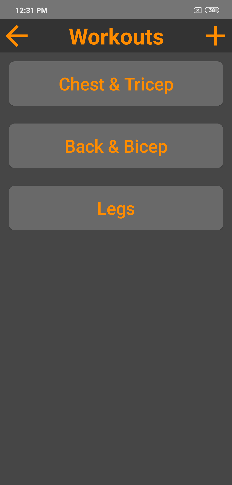
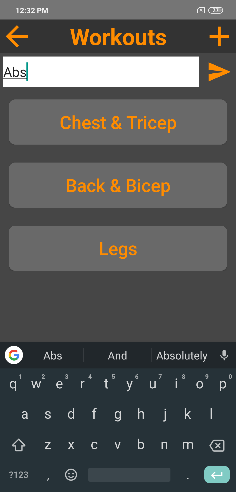
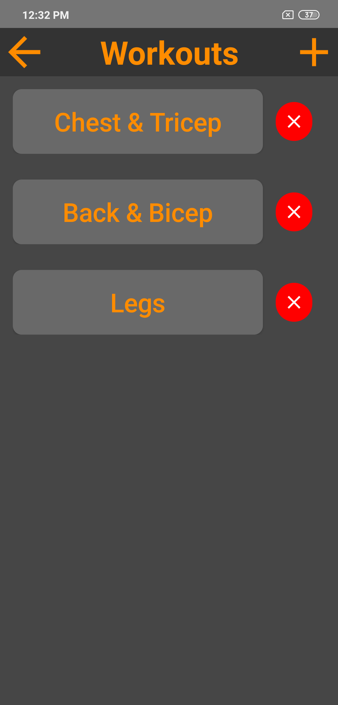
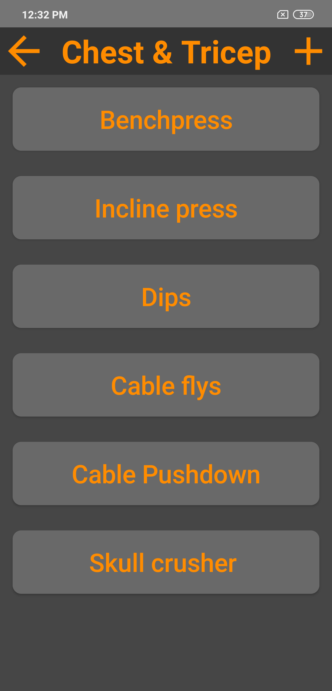
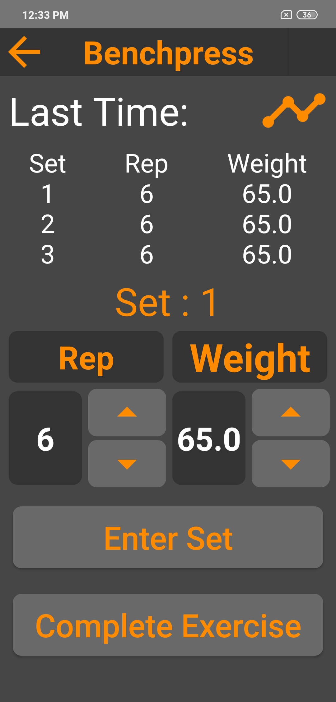
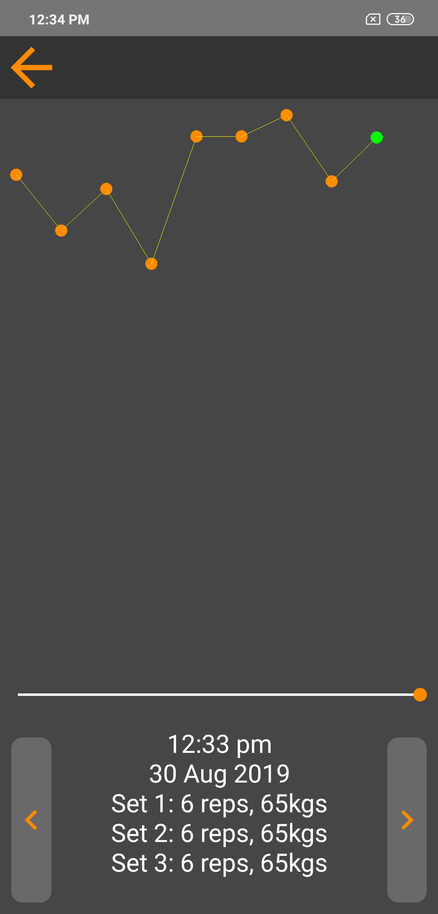

# GymTracker
Android app to track progress at the gym.

## Home Screen - Workouts

This is the first activity, the user can see all the workouts.
 

The user can add new workouts via the drop-down bar.

The user can also delete workouts by long pressing on any of the workout buttons

## Workout activity
Here the user can see all the exercises associated with an activity. They are also able to add exercises here the same way as in the workout activity.

# Exercise activity

Here the user can see what they did at the gym last time for this exercise. They can adjust the reps and the weight to whatever they want to do this time, enter the sets that they do and complete exercise when they have finished the number of sets they wanted to do. From here if the user clicks on the progress button in the top right they will be taken to the progress activity.

#Progress activity

Here the user can see their lifetime progress of the exercise. They can zoom in and out with the seek bar, and navigate the nodes with the left and right buttons. Each node represents a day at the gym and the data for the node will be displayed down the bottom.

